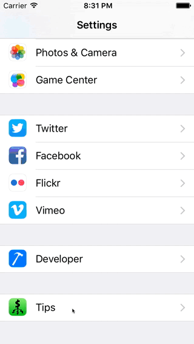
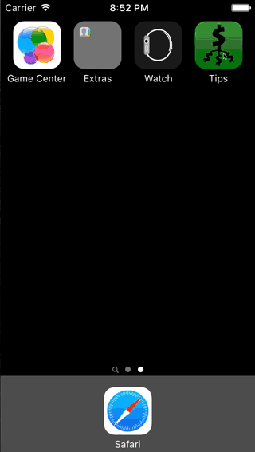
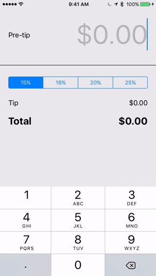

# Tips

This is a Tip Calculator application for iOS submitted as the [pre-assignment](https://gist.github.com/timothy1ee/7747214) requirement for CodePath.

## Description

The tip calculator can split for an arbitrary number of other people and supports four tip percentages with defaults in a settings bundle. When you've calculated your split, assuming your device supports messaging, you can pop up a message to send with the individual split amount.

## Codepath Details

Time spent: 5 hours

Completed:

* [x] Required: User can enter a bill amount, choose a tip percentage, and see the tip and total values.
* [x] Required: Settings page to change the default tip percentage.
* [x] Optional: UI animations
* [x] Optional: Remembering the bill amount across app restarts (if <10mins)
* [x] Optional: Using locale-specific currency and currency thousands separators.
* [x] Optional: Making sure the keyboard is always visible and the bill amount is always the first responder. This way the user doesn't have to tap anywhere to use this app. Just launch the app and start typing.
* [x] Extra: Reset all input and revert to default tip percentage
* [x] Extra: Total splittable by arbitrary amount of people
* [x] Extra: Send message to friends with amount per person
* [x] Extra: Layout remains consistent from smaller to larger phones

## Walkthroughs

1. [iPhone 5s Simulator] Main features including tip calculation, US locale formatting, first responder, splitting the bill, animating the split content in and out with the presence and absense of the keyboard, reset option, and persistence after app close

2. [iPhone 5s Simulator] Settings bundle and seeing the default reflected when opening the app that had been freshly installed
 

3. [iPhone 5s Simulator] Locale differences when device is set to United Kingdom.

4. [iPhone 6s Device] Appropriate layout with larger screen, messaging.

